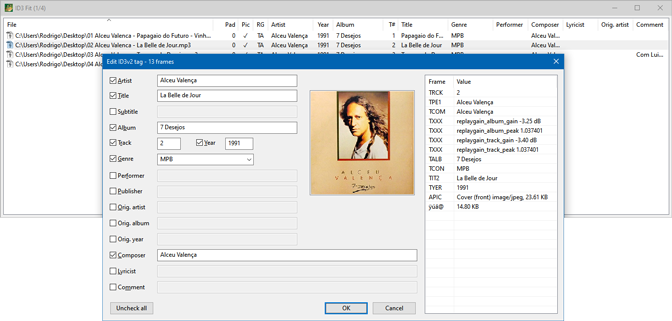

# ID3 Fit

A native Windows editor for [ID3 v2.3.0](https://id3.org/id3v2.3.0) tags in MP3 files.

## Dependencies

This project is written in Go and uses [Windigo](https://github.com/rodrigocfd/windigo) library.

## License

Licensed under [MIT license](https://opensource.org/licenses/MIT), see [LICENSE.md](LICENSE.md) for details.
